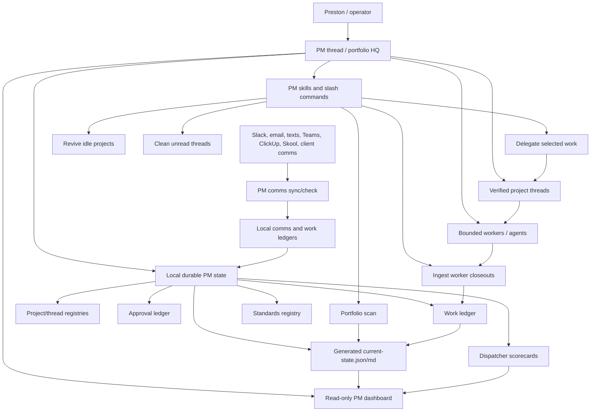
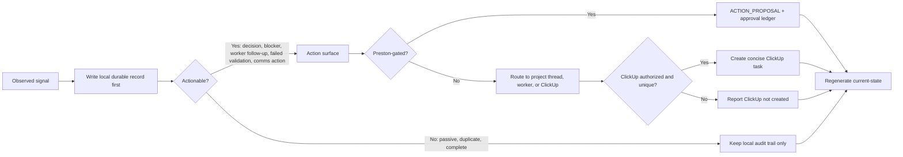
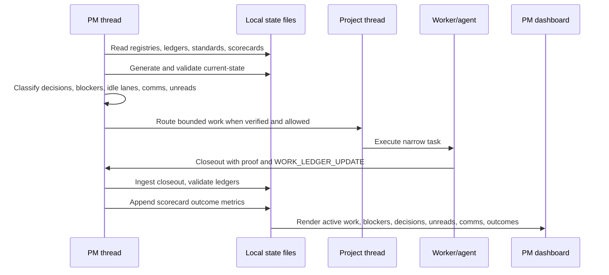

# PM System Overview

This is the compact map of the SGS/Codex project-management operating system.
The deeper docs live under [docs/pm-systems](pm-systems/README.md).

The core idea is simple: chat is the control surface, but durable files are the
source of truth. The PM thread coordinates scans and decisions, project threads
hold project context, workers do bounded work, and ledgers preserve state across
compaction, restarts, and future PM passes.

## Operating Picture

## Durable State Flow

## Outcome Loop

## Command Families

- `PM Project Portfolio Manager`: broad scan, durable state refresh, decisions,
  blockers, safe next moves, scorecard updates.
- `PM Delegate`: route highlighted work to the right verified project thread or
  bounded worker.
- `PM Plate Spin`: identify small safe next prompts for idle projects.
- `PM Clean Unreads`: mark only truly complete unread threads as read and keep
  incomplete work visible.
- `PM Ingest Closeout`: ingest worker/project closeouts into the work ledger and
  refresh current-state.
- `PM Comms Check` and `PM Comms Sync`: consolidate communication follow-ups
  from monitored channels.
- `PM Dashboard`: launch the local read-only cockpit.

## Safety Rules

No deploys, production mutations, external messages, database permission/RLS
changes, protected-branch operations, purchases, or Codex thread creation or
messaging happen without a fresh `ACTION_PROPOSAL` and explicit approval.

ClickUp is an action surface, not the source of truth. Every observed item lands
in the local ledger/report layer first; ClickUp tasks are created only for
actionable follow-ups with dedupe keys.

## Current Health

The system now has:

- durable registries, approval ledger, work ledger, standards registry, and
  dispatcher scorecards
- generated `current-state.json` and `current-state.md`
- closeout ingestion
- delegation watchlist
- durable clean-unreads reports
- local ledger/ClickUp hybrid policy
- read-only PM dashboard
- dispatcher outcome scorecards that separate activity from actual movement

The next useful evolution is trend reporting across scorecard outcomes and
cleaner automated comms coverage across every source.
