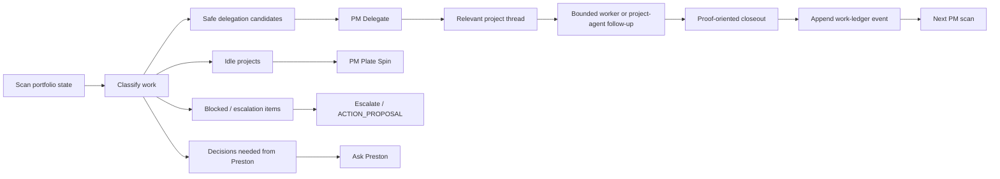
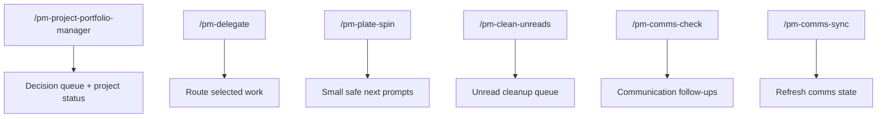
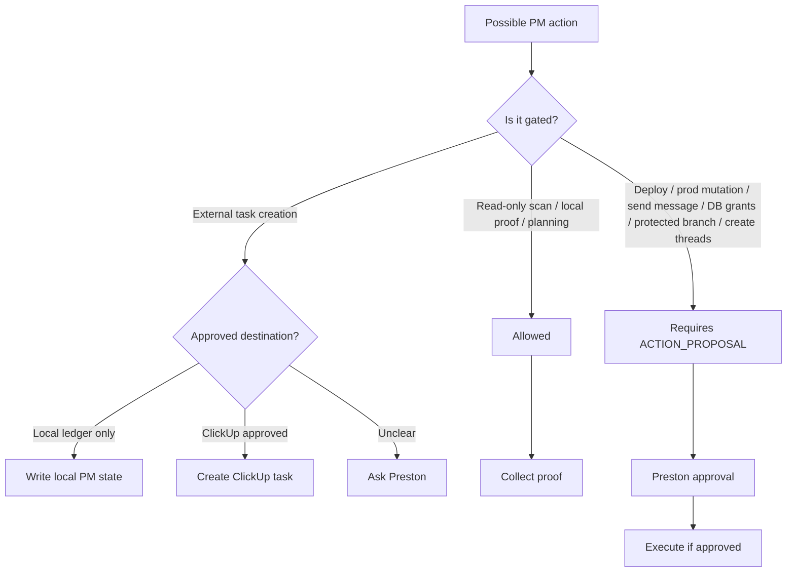

# PM System Overview

This file is retained as a compact overview. The dedicated PM systems docs now
live under [docs/pm-systems](pm-systems/README.md).

## System Map

```mermaid
flowchart TD
  Preston["Preston"] --> PMThread["PM Thread / Portfolio HQ"]

  PMThread --> Skills["PM Skills + Slash Commands"]
  PMThread --> State["Portfolio State Files"]
  PMThread --> Threads["Project Threads / Workers"]
  PMThread --> Sources["External Work Sources"]

  Skills --> PMPortfolio["PM Project Portfolio Manager"]
  Skills --> PMDelegate["PM Delegate"]
  Skills --> PMPlate["PM Plate Spin"]
  Skills --> PMClean["PM Clean Unreads"]
  Skills --> PMCommsCheck["PM Comms Check"]
  Skills --> PMCommsSync["PM Comms Sync"]

  State --> ProjectRegistry["project-registry.md"]
  State --> ThreadRegistry["thread-registry.md"]
  State --> ApprovalLedger["approval-ledger.md"]
  State --> WorkLedger["work-ledger.jsonl"]
  State --> Standards["standards-registry.md"]
  State --> Scorecards["dispatcher scorecards"]

  Threads --> Persistent["Verified Persistent Project Threads"]
  Threads --> Workers["Bounded Worker Threads / Agents"]

  Sources --> Slack["Slack"]
  Sources --> Email["Email"]
  Sources --> ClickUp["ClickUp"]
  Sources --> Teams["Teams"]
  Sources --> Texts["Text Threads"]
  Sources --> Skool["Skool / Communities"]
```

## Main PM Loop

## Command Responsibilities

## Safety Gates

## Current Gaps

- Closeout ingestion is still partly manual.
- Clean-unreads status should write durable run reports.
- Communication source coverage needs a normalized source registry and dedupe
  keys.
- A derived current-state view would make broad scans faster and less reliant
  on thread replay.
- A read-only PM dashboard would make active, blocked, waiting, and decision
  queues easier to inspect.
