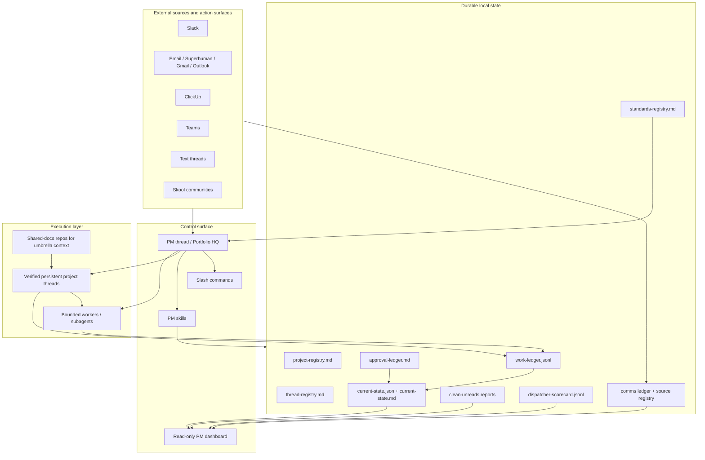
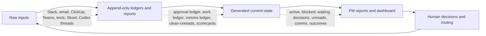
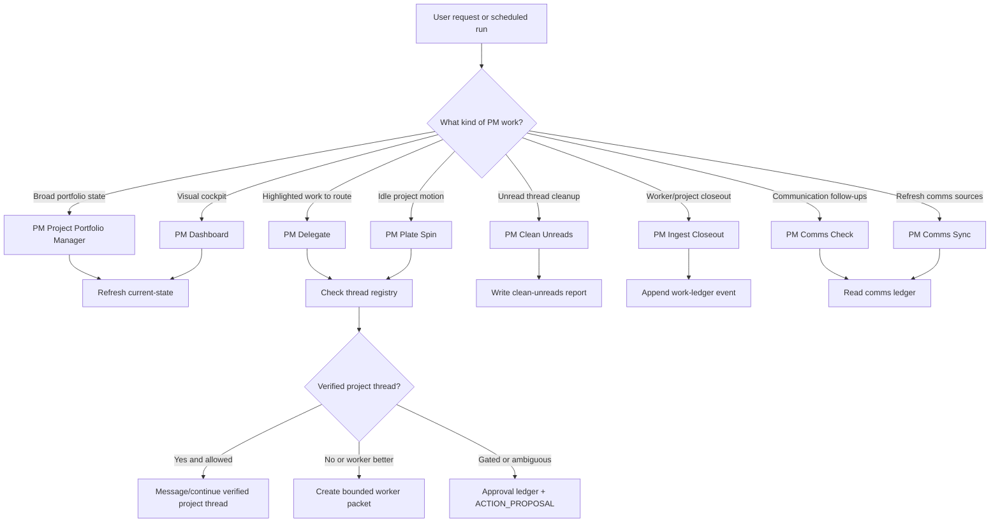
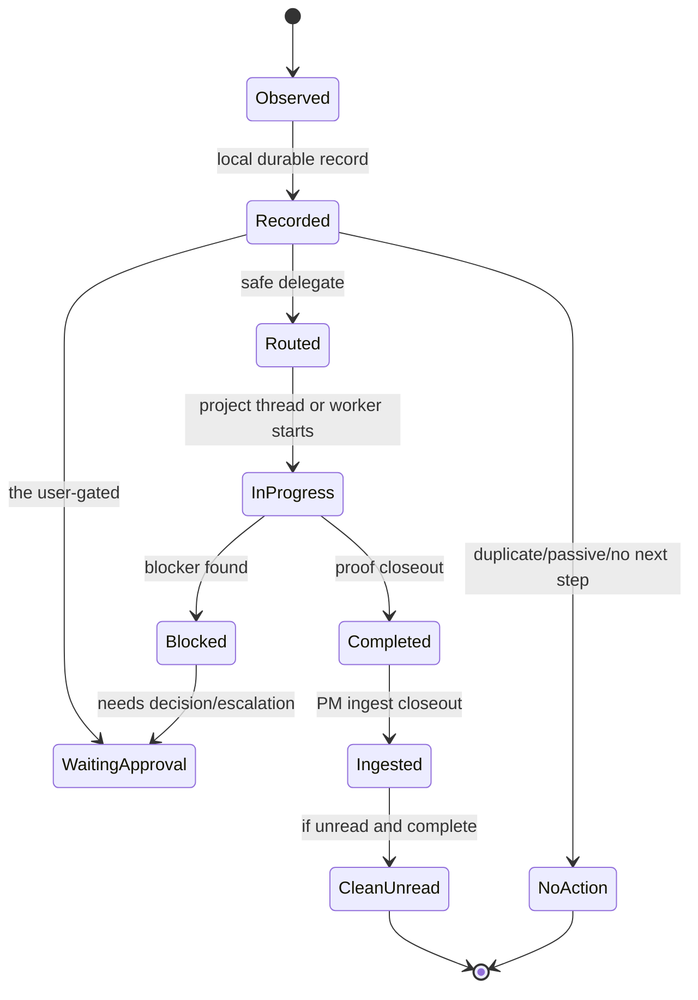
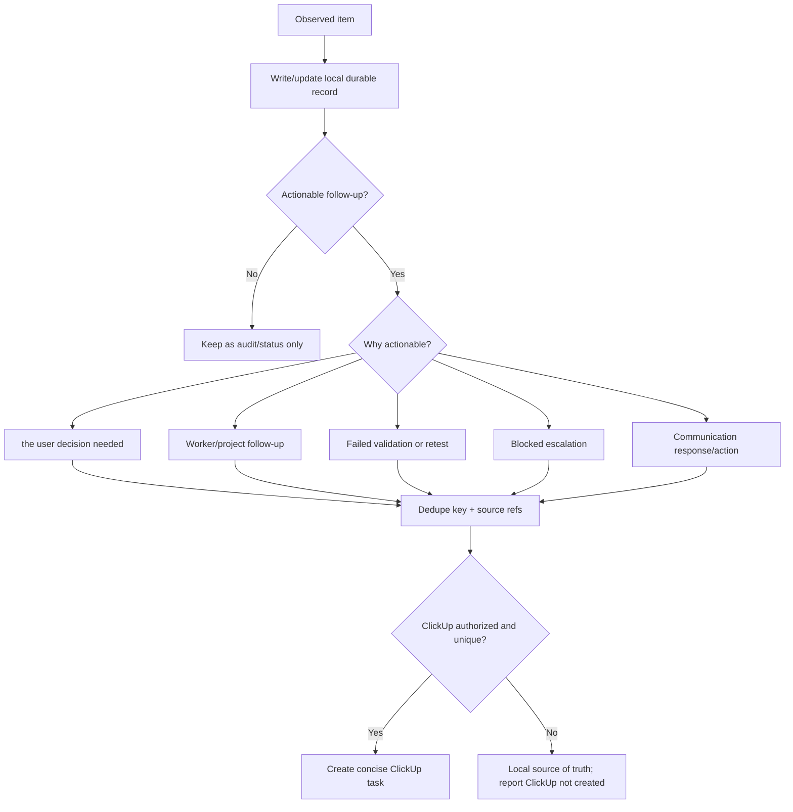
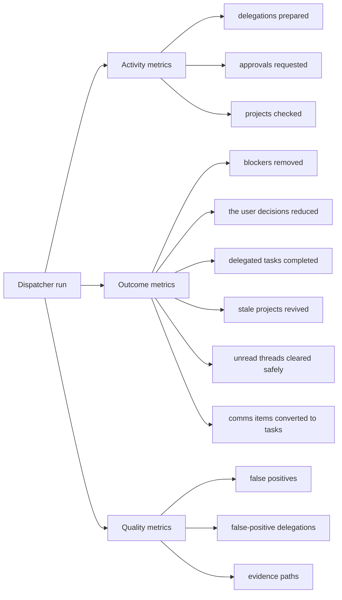
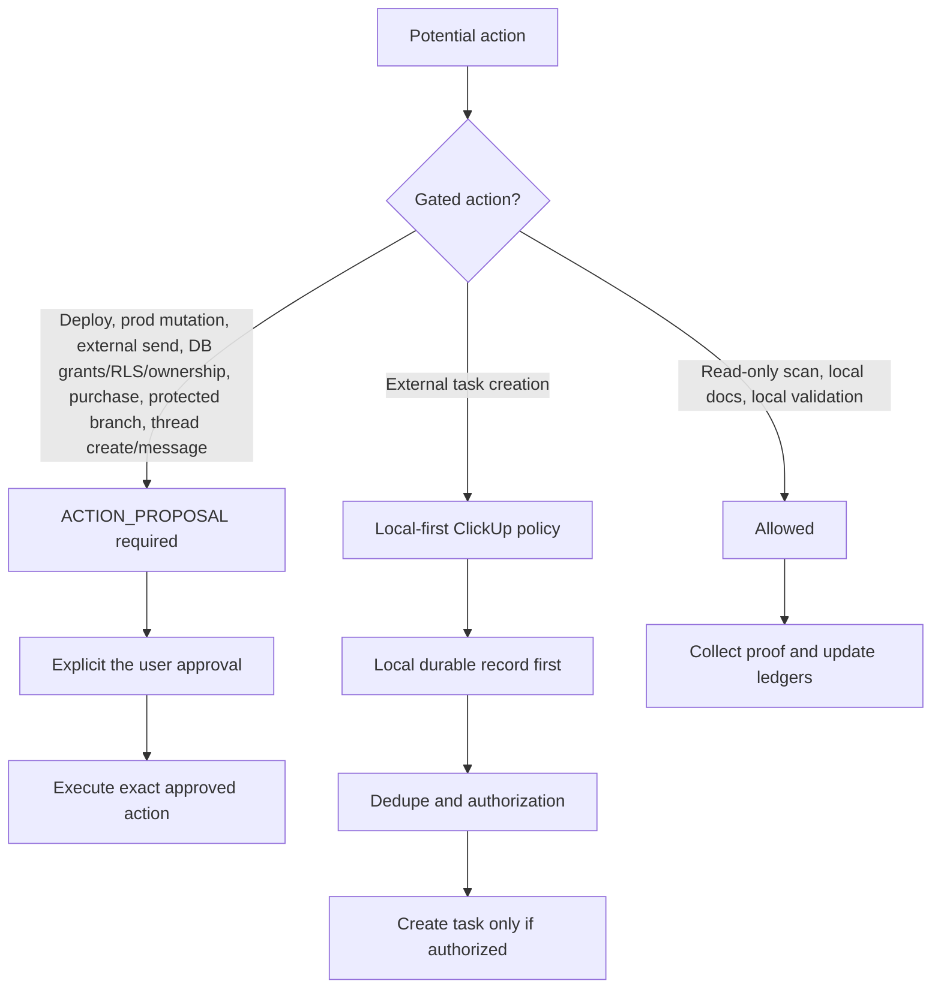

# PM System Architecture

The PM system is a local-first operating layer around Codex. It is designed to
keep many projects moving without relying on chat history as memory. Agents can
scan, classify, delegate, and validate, but the durable state lives in files.

## Architecture At A Glance

## State Is Layered

Raw inputs can be messy and spread across tools. Ledgers normalize the observed
facts. `current-state` is regenerated from those sources so PM scans can start
from a compact machine-readable snapshot instead of replaying every thread.

## Command And Skill Routing

## Delegation Lifecycle

Every lifecycle change should be reflected in `work-ledger.jsonl`, and every
the user-gated decision should be reflected in `approval-ledger.md`.

## Local Ledger / ClickUp Hybrid

The local ledger is the audit and memory layer. ClickUp is only the actionable
task surface. Ready-to-mark-read items, passive waiting statuses, duplicates,
completed/no-op states, and observations with no next action stay local only.

## Dispatcher Scorecards

Scorecards intentionally separate activity from movement. Preparing packets,
surfacing approvals, and checking projects are useful activity. They are not
outcomes until a blocker clears, a decision is reduced, a delegated task
finishes, a stale project revives, an unread is safely cleared, or a comms item
becomes an actionable task.

## Safety Boundary

## Core Principle

The PM thread can reason, coordinate, and explain, but it should not be the only
place where project state exists. Durable records and generated current-state
are what make the system survivable, auditable, and automatable.
