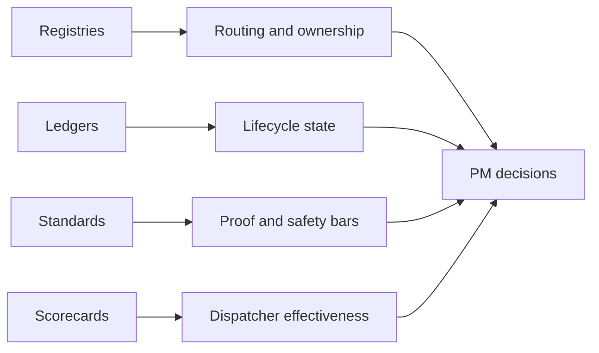

# PM System Architecture

The PM system treats chat as the control surface and durable files as the
source of truth. The PM thread coordinates work; project threads hold project
context; workers execute bounded tasks; ledgers preserve state across
compaction and future scans.

```mermaid
flowchart TD
  User["User / operator"] --> PMThread["PM Thread / Portfolio HQ"]

  PMThread --> Skills["PM Skills + Slash Commands"]
  PMThread --> State["Durable Portfolio State"]
  PMThread --> Threads["Project Threads / Workers"]
  PMThread --> Sources["External Work Sources"]

  Skills --> PMPortfolio["PM Project Portfolio Manager"]
  Skills --> PMDelegate["PM Delegate"]
  Skills --> PMPlate["PM Plate Spin"]
  Skills --> PMClean["PM Clean Unreads"]
  Skills --> PMCommsCheck["PM Comms Check"]
  Skills --> PMCommsSync["PM Comms Sync"]

  State --> ProjectRegistry["project-registry.md"]
  State --> ThreadRegistry["thread-registry.md"]
  State --> ApprovalLedger["approval-ledger.md"]
  State --> WorkLedger["work-ledger.jsonl"]
  State --> Standards["standards-registry.md"]
  State --> Scorecards["dispatcher scorecards"]

  Threads --> Persistent["Verified Persistent Project Threads"]
  Threads --> Workers["Bounded Worker Threads / Agents"]

  Sources --> Slack["Slack"]
  Sources --> Email["Email"]
  Sources --> ClickUp["ClickUp"]
  Sources --> Teams["Teams"]
  Sources --> Texts["Text Threads"]
  Sources --> Skool["Skool / Communities"]
```

## Durable State Roles

## Core Principle

The system should not rely on chat memory for project state. Chat can explain,
coordinate, and decide, but every durable PM transition should land in a
validated file: registry, approval ledger, work ledger, scorecard, report, or
project artifact.

