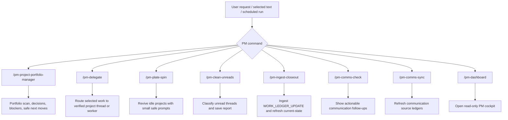
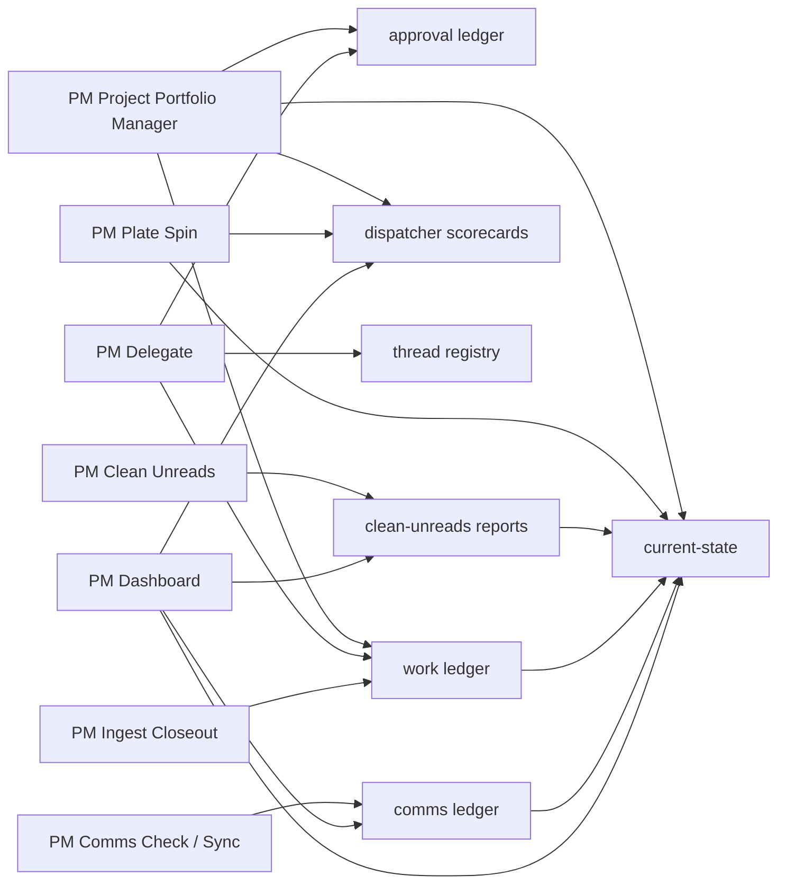

# PM Command Map

The PM commands are thin entrypoints into skills. They should all preserve the
same safety boundary: local durable records first, external action only after
authorization, and no gated action without an `ACTION_PROPOSAL`.

## Command Routing

## Responsibilities

| Command | Primary job | Writes local state? | External action? |
| --- | --- | --- | --- |
| `PM Project Portfolio Manager` | Broad portfolio scan, blocker queue, decision queue, dispatcher scorecard | Yes, when durable PM state changes | No gated action without `ACTION_PROPOSAL` |
| `PM Delegate` | Route highlighted work to the right project context | Yes, work/delegation status when applicable | Only verified project-thread messaging when allowed and approved |
| `PM Plate Spin` | Find small safe next prompts for idle projects | Yes, scan/report/scorecard when applicable | No deploy/send/prod mutation |
| `PM Clean Unreads` | Clear only completed, validated unread threads | Yes, durable clean-unreads report | May mark read only when proof bar is satisfied |
| `PM Ingest Closeout` | Extract and validate worker closeout updates | Yes, work ledger and current-state | None |
| `PM Comms Check` | Show obligations from communication ledgers | Yes, observed follow-ups when applicable | No replies/sends by default |
| `PM Comms Sync` | Refresh monitored communication sources | Yes, comms ledger/source records | No replies/sends by default |
| `PM Dashboard` | Launch read-only cockpit | Regenerates current-state only | None |

## Command-To-State Map

## Naming Convention

PM skills and slash commands should all begin with `PM` in display metadata and
`pm-` in file/command names. The naming is intentional: typing `. PM` or `/pm`
should reveal the PM operating system commands as a group.

## Practical Rule

Use the narrowest PM command that matches the work:

- selected task needs routed: `PM Delegate`
- unread thread cleanup: `PM Clean Unreads`
- worker closeout: `PM Ingest Closeout`
- idle projects: `PM Plate Spin`
- all-project state: `PM Project Portfolio Manager`
- current cockpit: `PM Dashboard`
