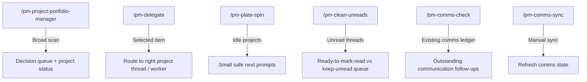

# PM Command Map

## Responsibilities

- `PM Project Portfolio Manager`: broad portfolio state, blocker/decision queue,
  safe delegation candidates, scorecard/ledger updates.
- `PM Delegate`: route highlighted or selected work to the verified project
  thread or a bounded worker.
- `PM Plate Spin`: revive idle projects with small, safe, proof-oriented next
  prompts.
- `PM Clean Unreads`: classify unread threads and only mark/read items that are
  truly complete.
- `PM Comms Check`: consolidate communication follow-ups from existing state.
- `PM Comms Sync`: refresh communication monitoring outside the scheduled run.

## Naming Convention

PM skills and slash commands should all begin with `PM` in display metadata and
`pm-` in file/command names.

