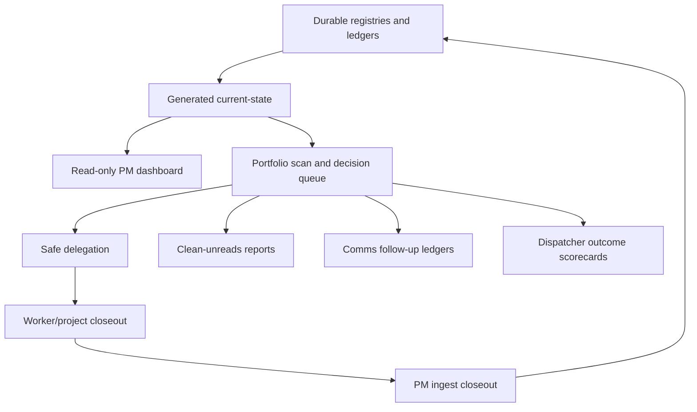
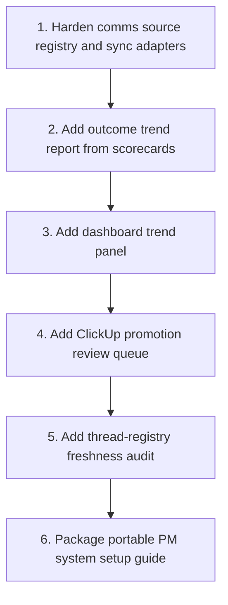

# PM System Gaps And Roadmap

The core PM operating loop is now in place: durable ledgers, current-state
generation, approval schema, delegation watchlist, closeout ingestion,
clean-unreads reports, local-ledger/ClickUp hybrid policy, PM dashboard, and
dispatcher outcome scorecards.

## Current Capabilities

## Remaining Gaps

1. Communication coverage is not yet uniformly connected across every source.
   The model exists, but each channel still needs reliable source-specific
   ingestion, source IDs, and dedupe keys.
2. Scorecard data tracks outcomes, but trend reporting is still manual. There
   is not yet a chart or weekly summary that shows whether outcome movement is
   improving.
3. ClickUp creation is intentionally gated and conservative. That is safer, but
   it means some actionable follow-ups still require manual promotion from local
   ledger to ClickUp.
4. Project-thread routing depends on the thread registry staying current. Any
   unbound or stale thread lane reduces delegation confidence.
5. The local dashboard is read-only. That is correct for safety, but edit flows
   still happen through skills/scripts rather than the cockpit.
6. Cross-platform portability exists as playbooks, but external teams still need
   adapter-specific setup for their own state paths, task systems, and comms
   connectors.

## Recommended Next Builds

## Target Outcome

The PM system should keep an accurate operating picture without requiring a
human to reread every thread:

- active delegated work
- waiting and blocked work
- exact Preston decisions blocking motion
- ready-to-clean versus keep-unread threads
- actionable communication follow-ups
- idle projects with safe next prompts
- delegation follow-through risks
- dispatcher outcomes, not just dispatcher activity

The key metric is not how many things the PM system notices. The key metric is
whether it reduces Preston's decision, routing, and follow-through burden while
respecting safety gates.
