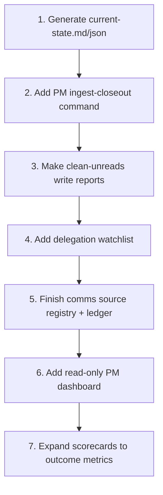

# PM System Gaps And Roadmap

## Current Gaps

1. Some state is still reconstructed from thread closeouts.
2. Worker closeout ingestion is still partly manual.
3. Clean-unreads reports are useful but should be saved as durable artifacts.
4. Approval items need stronger machine-readable status structure.
5. Delegation follow-through needs a watchlist for stale or completed-but-not-
   ingested work.
6. Communication monitoring needs normalized source registries and dedupe keys.
7. There is no single PM cockpit/dashboard yet.
8. Scorecards should measure outcomes, not just activity.

## Recommended Build Order

## Target Outcome

The PM system should produce a reliable operating picture without requiring a
human to reread every thread:

- active work
- waiting work
- blocked work
- decisions needed
- ready-to-clean unreads
- comms follow-ups
- idle projects
- delegation quality and outcomes

