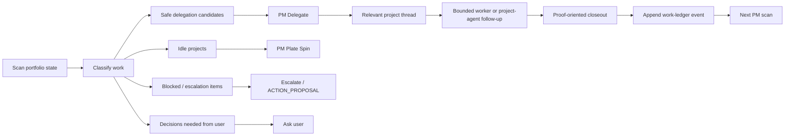
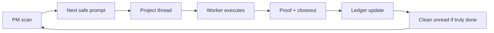

# PM Operations Loop

The main PM loop starts with a portfolio scan, classifies work, delegates only
safe bounded tasks, and then ingests proof back into durable state.

## Steady State

## Closeout Contract

Workers should return:

- status: `done`, `blocked`, `needs_approval`, or `no_new_signal`
- what changed or was found
- proof gathered
- validation commands and results
- files read/touched
- next recommended action
- handoff receipt
- approval proposal when needed
- work-ledger update recommendation

The PM thread reviews that closeout before updating durable state.

