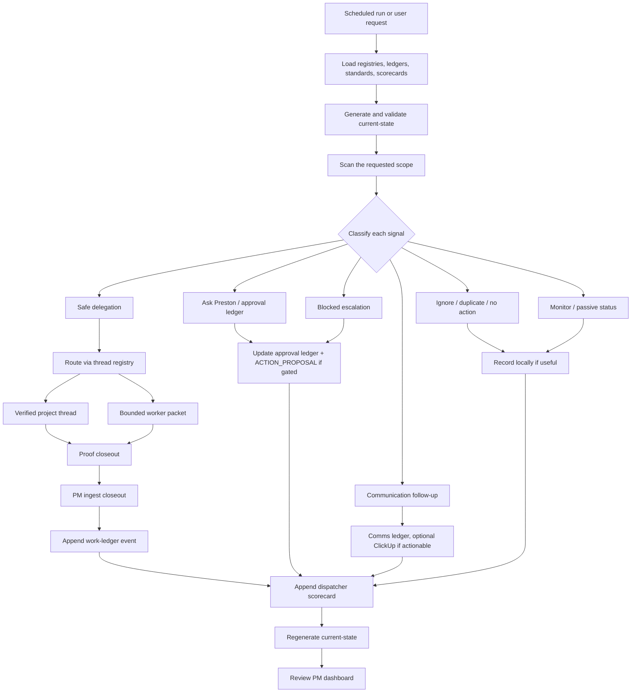
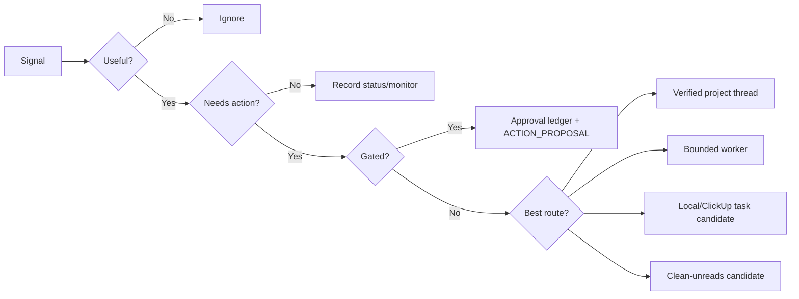
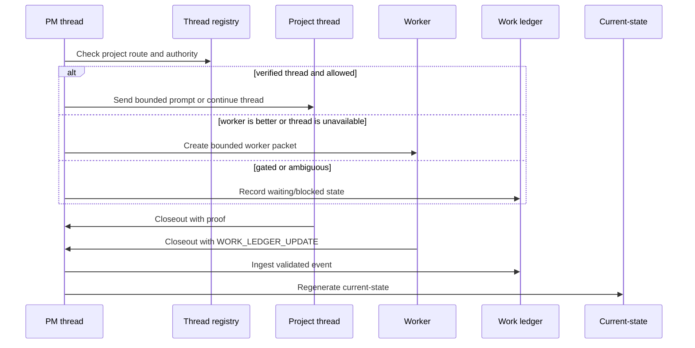
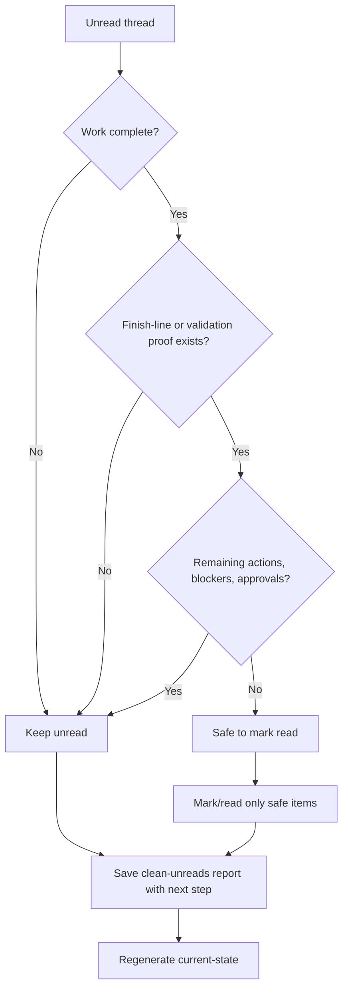
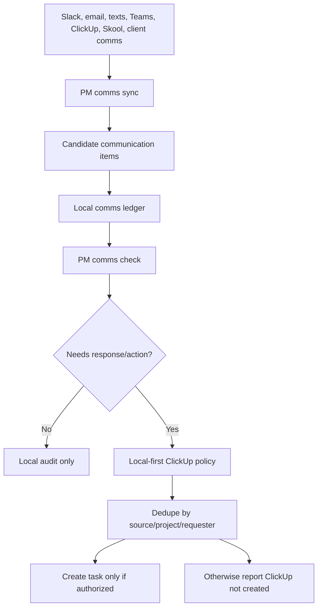
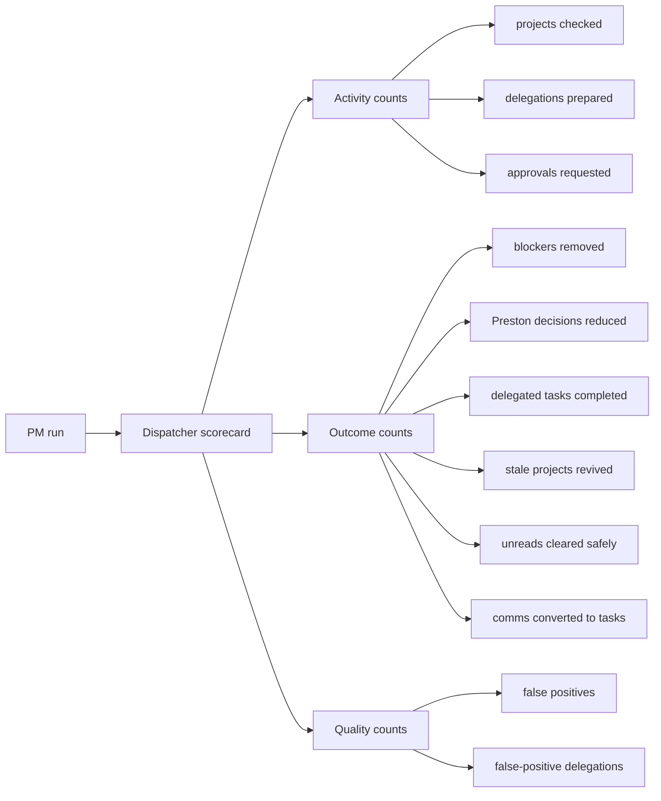

# PM Operations Loop

The PM loop is designed to keep projects moving without creating noise. It
starts with durable state, routes only safe work, and closes the loop by
ingesting proof back into ledgers.

## End-To-End Loop

## Scan Classification

Signals should be deduped against the approval ledger, work ledger, comms
ledger, clean-unreads reports, and latest dispatcher artifact before creating
new work.

## Delegation And Closeout

Closeouts should include:

- status: `done`, `blocked`, `needs_approval`, or `no_new_signal`
- what changed or was found
- proof gathered
- validation commands and results
- files read or touched
- next recommended action
- approval proposal when needed
- `WORK_LEDGER_UPDATE` when lifecycle state changed

## Clean-Unreads Loop

If a thread is not complete, it stays unread and the report must state the next
needed step.

## Comms Loop

The PM comms system should flag possible obligations without sending replies or
creating external tasks unless that action is authorized.

## Outcome Measurement

The scorecard should reward movement, not busyness. Outcome fields stay zero
unless the run artifact, work ledger, approval ledger, clean-unreads report, or
comms ledger proves actual movement.

## Daily Use

1. Start from `/pm-dashboard` or `PM Project Portfolio Manager`.
2. Refresh current-state before broad decisions.
3. Work the exact decision/blocker queue.
4. Delegate only bounded, proof-oriented work.
5. Ingest closeouts before cleaning unreads.
6. Use scorecards to ask: did the run move work or only create activity?
