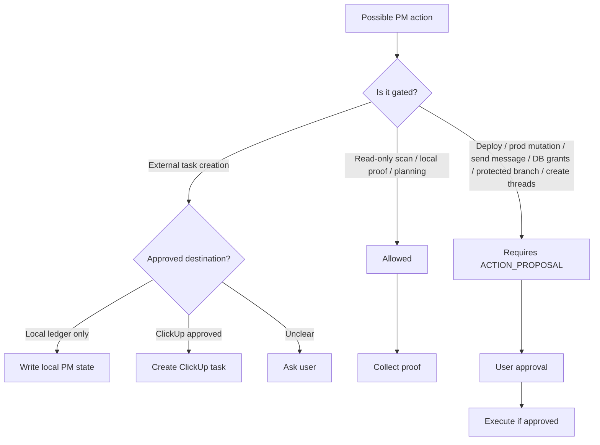

# PM Safety Gates

The PM system is designed to keep autonomous work useful without allowing
dangerous or irreversible actions to happen quietly.

## Always Approval-Gated

- production deploys or hotfixes
- production data mutation
- external sends: email, SMS, Slack, Teams, customer/client messages
- DB permission, grant, role, ownership, or RLS changes
- billing, purchasing, or paid external jobs
- protected branch operations
- destructive Git cleanup
- creating or messaging new persistent threads unless explicitly authorized

## Proof Separation

Keep these claims separate:

- local validation
- hosted/browser validation
- dev/staging live validation
- production live validation

Do not imply one proves another.

