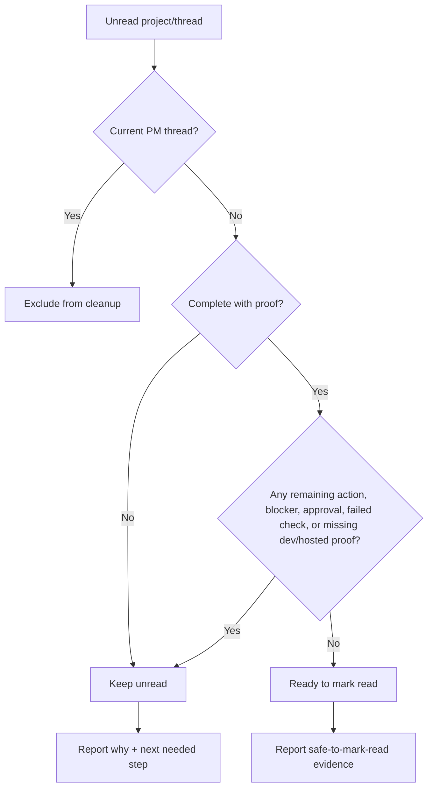

# Unread Cleanup

Unread cleanup is intentionally conservative. A thread being quiet is not
enough. It can be marked read only when work is truly complete and no remaining
action, approval, blocker, or missing proof exists.

## Keep Unread When

- thread is active or mid-validation
- worker closeout is missing
- validation failed or is incomplete
- dev/hosted proof is missing where applicable
- the latest message asks for a decision, approval, deploy, review, send, or
  next implementation step
- a work-ledger event still says delegated, waiting, or blocked

## Ready To Mark Read When

- the latest status is complete
- final answer or closeout says the scoped work is complete
- relevant finish-line/dev/hosted validation is present
- no approval or blocker remains
- no next step requires user attention

